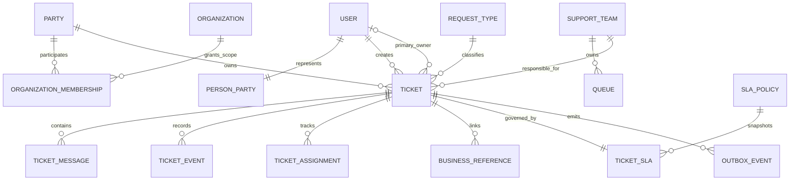

# معماری هدف و مرز ماژول‌ها

وضعیت: مصوب در قرارداد `R1-v1`

## سبک معماری

پروژه به شکل Modular Monolith باقی می‌ماند. هدف، ایجاد مرزهای روشن در یک Process و یک
Database است؛ نه ساخت لایه یا Service مستقل برای هر جدول.

```text
Browser / App
    |
Next.js Page + Route Handler (/api/v2)
    |
Application Use Case + Authorization Context
    |
Domain policy / state transition / calculation
    |
Prisma transaction + External Ports + Outbox
    |
MySQL / BarghTo services / S3 / notification providers
```

## ساختار هدف کد

این ساختار در فازهای بعدی به‌صورت تدریجی ایجاد می‌شود:

```text
src/
  app/
    api/v2/                 # HTTP transport only
    support/                # customer experience
    workspace/              # agent/supervisor experience
  modules/
    identity/
    organizations/
    support-catalog/
    ticketing/
    sla-routing/
    knowledge/
    notifications/
    reporting/
    shared/
  lib/                      # legacy services and true cross-cutting infrastructure
```

داخل هر ماژول فقط پوشه‌های موردنیاز ایجاد می‌شوند:

```text
ticketing/
  domain/                   # pure state and invariant logic
  application/              # use cases and transaction coordination
  infrastructure/           # Prisma/external adapters where isolation is useful
  contracts/                # stable DTOs and schemas
```

ایجاد Repository، Class یا Interface برای هر Model ممنوع است. Interface فقط برای مرز خارجی،
Clock، Provider یا وابستگی‌ای ساخته می‌شود که تست و تعویض واقعی آن ارزش دارد.

## ماژول‌ها و مالکیت داده

| ماژول | مسئولیت | داده تحت مالکیت | وابستگی مجاز |
| --- | --- | --- | --- |
| Identity | Session، Current User و Actor identity | User/Session فعلی | Security infrastructure |
| Organizations | Party، شرکت، عضویت، Scope و Approval حساس | Party، Organization، Membership، Approval | Identity؛ External organization source |
| Support Catalog | Service، Request Type، Team، Queue و Policy version | Catalog/Team/Queue metadata | Organizations برای اعضای تیم |
| Ticketing | Ticket، Message، Note، Assignment، Transition و Business Reference | Ticket aggregate و TicketEvent | Identity، Organizations، Catalog؛ Portهای مرجع |
| SLA & Routing | انتخاب Rule، Deadline، Pause/Resume، warning و escalation | SlaPolicy/SlaClock/RouteDecision | Catalog و read model محدود Ticketing |
| Knowledge | Article، Version، Approval و audience | KnowledgeArticle/Version | Catalog و Organizations scope |
| Notifications | Outbox consumption، Delivery، preference و provider adapter | NotificationDelivery | Domain events؛ Identity contact projection |
| Reporting | KPI read model و aggregate | Reporting projections | فقط Eventهای مصوب و Query read-only |
| Attachments | upload، scan، storage، claim، download و cleanup | Attachment metadata/object references | Authorization والد Ticket/Message |

## قواعد وابستگی

- `app/api/v2` می‌تواند از Application Use Case و Contract ماژول import کند؛ Domain نباید
  Next.js، Request، Response یا React را import کند.
- Domain logic نباید Prisma Client یا Provider SDK را import کند.
- ماژول‌ها Model دیتابیس یکدیگر را مستقیم mutate نمی‌کنند؛ Use Case مالک عملیات هماهنگی است.
- Reporting هیچ عملیات command روی Ticketing ندارد.
- Notifications نمی‌تواند وضعیت Ticket را تغییر دهد.
- Knowledge نمی‌تواند پاسخ عمومی را بدون Use Case و Permission Ticketing ارسال کند.
- External Serviceها فقط از Port/Adapter محدود و دارای timeout فراخوانی می‌شوند.
- import از مسیر داخلی ماژول دیگر ممنوع است؛ فقط `contracts` یا entry point عمومی مجاز است.
- `src/lib` محل Dump شدن helperهای جدید نیست. فقط Infrastructure واقعاً مشترک مانند Prisma،
  logger، security config و request correlation در آن می‌ماند.

## Aggregate و Transaction Boundary

Ticket Aggregate شامل Ticket، وضعیت جاری، Assignment جاری، Message command و Eventهای همان
عملیات است. عملیات زیر باید در یک Transaction دیتابیس انجام شوند:

- ایجاد Ticket + تصمیم Routing + SLA snapshot + Event + Outbox
- Assignment/Transfer + Version increment + Event + Notification request
- افزودن Message + claim فایل + state effect + Event + Outbox
- Resolve/Confirm/Close/Reopen + SLA effect + Event + Outbox
- تغییر حساس + Approval decision + Audit + Event مرتبط

فراخوانی HTTP یا Provider خارجی داخل Transaction دیتابیس انجام نمی‌شود. ابتدا State و Outbox
commit می‌شوند و سپس Worker/Job تحویل را انجام می‌دهد.

## مدل مفهومی داده

این نمودار قرارداد مفهومی است و نام نهایی Table/Column در R2 تا R5 با Migration review
قطعی می‌شود:



Party مالک کسب‌وکاری Ticket است و User فقط Actor ایجادکننده است. به همین دلیل Ticket شرکت
با حذف یا تغییر نماینده، مالکیت سازمانی خود را از دست نمی‌دهد.

## مدل خواندن

- صفحه جزئیات Ticket از DTO اختصاصی Customer یا Workspace استفاده می‌کند.
- DTO کاربر هیچ فیلد Internal Note، internal routing reason یا sensitive unmasked ندارد.
- فهرست‌ها Cursor-based و Projection-based هستند؛ relationهای سنگین فقط هنگام نیاز load می‌شوند.
- Dashboard از Aggregate سمت سرور استفاده می‌کند و فهرست ۱۰۰۰ تایی به Client نمی‌فرستد.
- Full-text/semantic search در مرز Knowledge یا Search Projection است، نه Query خام روی Message.

## Runtime و Jobها

در V1 Jobها می‌توانند با Endpoint داخلی محافظت‌شده یا Worker process همان Image اجرا شوند،
اما Handler باید idempotent و lock آن دیتابیسی باشد. Jobهای SLA، Outbox، Retention و Cleanup
Owner، timeout، batch size، retry و metric مستقل دارند.

## مرز Next.js

Route Handlerهای App Router endpoint عمومی هستند و Authentication/Authorization در خود
Handler/Application boundary تکرار می‌شود؛ Proxy فقط pre-filter است. GETهای حاوی اطلاعات
کاربر یا سازمان cache عمومی نمی‌شوند. UI می‌تواند Server Component یا Client Component باشد،
اما Permission از تصمیم Client استخراج نمی‌شود.

## Conformance rules برای پیاده‌سازی

- Route جدیدی که Prisma را مستقیم mutate کند پذیرفته نیست.
- Mutation بدون Application Use Case، Authorization Context و Transaction review پذیرفته نیست.
- DTO مشترک Customer/Workspace پذیرفته نیست.
- Dependency cycle میان ماژول‌ها build را fail می‌کند.
- هر External Adapter contract test، timeout و error mapping دارد.
- هر Command حساس concurrency و idempotency behavior صریح دارد.
